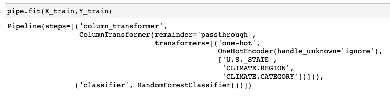
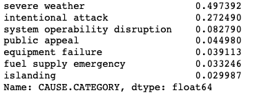

Report by Saarth Shah and Saathvik Dirisala

## **Introduction**

### Introduction and Prediction Question Identification

For this study, we will focus on:

`People are extremely dependent on power to get on with their daily lives. In this study, we want to predict what might cause a power outage based on information that would intuitively be available to a person "during" or at the "beginning" of an outage.`

<b>Knowing what might have caused an outage have some of the following benefits:</b>

<ul>

<li>Improving Power Grid Recovery: By understanding the common causes of power outages, power grid operators can take steps to improve the ability of the power grid to undo damages and reduce the likelihood of future outages.</li>

<li>Faster Response to Outages: If the cause of a power outage can be quickly identified, power grid operators can respond more quickly to restore power to affected areas, reducing the duration of the outage and minimizing the impact on people's daily lives.</li>

<li>Planning for Outages: Knowing the likely causes of power outages can help people and communities plan for potential outages and take steps to mitigate their impact. For example, people may choose to have backup generators or stock up on essential supplies during periods of high risk.</li>
    
</ul>

<b>Therefore for this study we will be building a multi-class classifier to predict `CAUSE.CATEGORY.` To test this model we will be using the <b>F-1 score</b> as a metric to test the strength of our classifier due to the following reasons:</b>

<ul>
    <li>The proportion of power outages in our dataset caused due to severe weather were around 0.497392, so if our classifier simply always predicts 'severe weather' as a category then it might achieve a high accuracy. However, as we account for both recall and precision in F-1 score, it will be a better test to gauge the strength of our classifier.</li>
    <li>As the number of instances in each class may be too small to provide accurate predictions, F1 score can be more useful than accuracy in such cases because it the utlizes both precision and recall, which help ensure that all classes are correctly identified.</li>
</ul>

<b>Model Type:</b> Multiclass Classifier  
<b>Response Variable:</b> `CAUSE.CATEGORY` 
<b>Metric:</b> F-1 Score 

<b>Information needed during the “time of prediction”:</b>
<ul>
    <li><b>US State where the Outage is Happening:</b> Knowing the state where the outage is happening is important because it helps in determining the the policies, resources and the infrastructure available to handle power outages in that state. For any power outage that is happening at a given time, we would know it's affected geographical location and ultimately its State</li> 
    <li><b>Climatic Region of the State where the outage is Occuring:</b> Climatic conditions like hurricanes, rain and snow can affect the supply of power and damages caused due to severe weather conditions. For any power outage that is happening at a given time, we would know it's affected geographical location and ultimately its climatic and weather conditions</li> 
    <li><b>Time stamp of when the Outage started:</b> During Off-work hours and weekends, there is a likelyhood of higher intentional attacks to power grids due to less security. For any power outage that is currently happening, we are likely to know what time it started.</li> 
    <li><b>Total Price of Electricity in the Area where the Outage is Happening:</b> The price of electricity in the area where the outage is occurring is important because it can indicate the infrastructure available to maintain the power grid and the incentives for the utility company to invest in proper infrastructure. It is easily available through official government websites, utility company websites, or public databases.</li> 
    <li><b>Percentage of Land in the Area where the Outage is Happening:</b> This information is required to determine the size and scope of the outage, particularly for larger regions. The percentage of land in the area can be obtained through geographic information system (GIS) data or through government agencies. </li> 
    <li><b>Total Number of Customers in the Area where the Outage is Happening:</b> This information would help us know potenitally how many people can be affected by this outage. Additionally, with more customers, power grid corporations are more likely to invest in more stable infrastructure. This information should be available to power corporations trying to predict outages.</li> 
    <li><b>Percentage of Urban Customers in the Area where the Outage is Happening:</b> This information is required to determine the impact of the outage on urban areas, particularly for emergency response efforts. Additionally, in more urbanized areas, the power corporations are more likely to upkeep latest infrastructure. The percentage of urban customers can be obtained from census data or through government agencies.</li> 
    <li><b>Percentage of Inland Water in the Area where the Outage is Happening:</b> This information is required to assess the potential impact of the outage on water resources, particularly for areas that rely on electricity for water treatment and distribution. The percentage of inland water can be obtained through GIS data or through government agencies.</li> 
    <li><b>The oceanic El Niño/La Niña (ONI) index at the place where the outage is occuring:</b>This information is required to determine the potential impact of the El Niño or La Niña weather patterns on the outage, particularly in coastal regions. The ONI index can be obtained through the National Oceanic and Atmospheric Administration (NOAA)</li>
</ul>

In this notebook we will be working with the <a href="https://engineering.purdue.edu/LASCI/research-data/outages/outagerisks">Power Outage</a> dataset to potentially find patterns that might be affecting how long a power outage lasts. Our dataset gives us access to the regional details of the outage, the prices of electricity, outage cause, people affected, etc. The relevant columns in our dataset mimic the information we would potenitally have at the onset of an outage.

Here's a quick description of the relevant columns in our dataset:

`YEAR`: Contains the year when this event happened   
`U.S._STATE`: Name of the US State where the Outage Happened   
`CAUSE.CATEGORY`: The reported reason for the Outage   
`CLIMATE.CATEGORY`: Current climate where the outage was reported   
`OUTAGE.START.DATE`: Date when the outage was reported   
`OUTAGE.START.TIME`: Time when the outage was reported   
`CLIMATE.REGION`: Climate in the specified region where the outage was reported   
`ANOMALY.LEVEL`: Represents the oceanic El Niño/La Niña (ONI) index referring to the cold and warm episodes by season.  
`MONTH`:  Contains the month when this event happened.  
`DAY_OF_WEEK`:  Contains the day of the week (Monday, Tuesday, etc) when this event happened.  
`TIME_OF_DAY`:  Contains the time of the day when this event happened.  
`TOTAL.PRICE`:  Contains the total price of electricity in the area where the outage happened.  
`PCT_LAND`:  Contains the percentage of land in the area where the outage happened.  
`TOTAL.CUSTOMERS`:  Contains the total number of customers in the area where the outage happened.  
`AREAPCT_UC`:  Contains the percentage of urban customers in the area where the outage happened.  
`PCT_WATER_INLAND`:  Contains the percentage of inland water in the area where the outage happened.  

## **Cleaning and EDA**

### **Data Cleaning**

Our data for this study is provided in an excel sheet that has certain useless columns that we can avoid during our analysis.

Before beginning the data cleaning, we first had to read the data properly by ensuring that pandas does not read these specific columns.

Our next step was to clean the dataset in order to make the rows and columns usable for our study. Here are some of the steps we took to properly clean the dataset:

1. The power outage start date and time is given by `OUTAGE.START.DATE` and `OUTAGE.START.TIME` which are two seperate columns. Aggregating the dates and times into a singular datetime object allowed us to quickly look into when the outages are starting with an exact time, without having to look into two seperate columns.

2. As our study emphasizes on the prediction of the cause of the power outage and other columns, it would make sense for us to drop any datapoints where we do not have a reported cause outage duration. Thereby dropping all columns where the cause of the power outage is null.

3. Additionally, we would also be factoring in the time of the day when this power outage occured by converting the time into seconds for us to easily analyze the numerical values.

4. We also dropped the `OUTAGE.RESTORATION.DATE`, `CUSTOMERS.AFFECTED`, `OUTAGE.DURATION` and `OUTAGE.RESTORATION.TIME` columns as we would likely not have access to these values at the time of predection.

5. The `DEMAND.LOSS.MW` column has too many NaN values. Furthermore, there it does not consistently report the same information, so we decided to drop that column from our analysis.

After thoroughly cleaning the dataset, here's a preview of our cleaned dataframe for power outages:

<iframe src="Plots/cleaned_df.html" width=800 height=320 frameBorder=0></iframe>

## **Baseline Model**

Initially, to build our classifier, we will train the model on the following features:
<ul>
    <li> <b>U.S._STATE (Qualitative Nominal)</b>: The state in which the power outage took place can provide the model with valuable information because some states are more prone to certain kinds of outages than others. A state may be more prone to hurricanes than others, and this would be valubale to the model in its prediction of cause.</li>
    <li> <b>CLIMATE.REGION (Qualitative Nominal)</b>: Climate region tells the model about the climate conditions of the state in which the outage has taken place. Climate conditions would likely have a causal relationship with the nature of the outage, thus helping the model better classify outages based on cause.</li>
    <li> <b>CLIMATE.CATEGORY (Qualitative Ordinal)</b>: Describes the oceanic El Nino / La Nina index as an ordinal variable. This is another climate-related variable that is related to the year, rather than the region. This will allow our model improve its classification by taking temporal factors into consideration</li>
    <li> <b>YEAR (Quantitative Discrete)</b>: This is an important factor that will help other features, like CLIMATE.CATEGORY to be of value to the model. Furthermore, this column may also encapsulate some trend in the distribution of the CAUSE.CATEGORY that may be useful to the model.</li>
    <li> <b>MONTH (Quantitative Discrete)</b>: The month in which an outage took place may provide the model with valuable information about the chances of each of the CAUSE.CATEGORYs occurring. For instance, winter time may see more outages in snowy regions due to weather.</li>
    
</ul>

To build our initial model, we will be using a <a href='https://scikit-learn.org/stable/modules/generated/sklearn.ensemble.RandomForestClassifier.html'>RandomForestClassifier</a> as they are an ensemble method that combines the results of multiple decision trees. This approach can help to reduce overfitting and improve the accuracy and stability of the prediction model. Additionally, random forest algorithm can handle nonlinear relationships between the input features and the response variable. This is important for power outage prediction, as there may be complex relationships between different factors such as weather patterns, infrastructure age, and population density. Thereby, for the baseline model, RandomForest seem to better than just training regular decision trees. 

**Feature Engineering**

For the Qualitative features, we will apply OneHotEncoding so that our model can properly account for the different categorical features. We will achieve this using the OneHotEncoder class and fitting it in a ColumnTransformer()

For example, suppose we have a categorical variable "color" with three categories: "red," "green," and "blue." To encode this variable using one-hot encoding, we would create three binary vectors, one for each category:

"red" : [1, 0, 0]
"green" : [0, 1, 0]
"blue" : [0, 0, 1]

As we have 3 categorical columns, we built a pipeline by using the ColumnTransformer to OneHotEncode the `U.S._STATE`,`CLIMATE.REGION`,`CLIMATE.CATEGORY` columns and letting `YEAR` and `MONTH` to passthrough. We then fit the pipeline on our training data and transformed the training and test data.

**Model Fitting**

To train and test our model, we will be using the standard 75-25 test-train split where 75% of data is used for training and 25% is used for testing.

Here's how our fitted model looks like:

**Model Evaluation**

Now, that we have trained our model, let's test it's performance on our training data. For this we will be using the f1_score which is a harmonic average of both precision and recall.

F1 Score: 0.917
Confusion Matrix:

<iframe src="Plots/baseline_train.html" width=800 height=320 frameBorder=0></iframe>

The confusion matrix shows the number of correct and incorrect predictions made by the model on the training data, broken down by class. The diagonal of the matrix represents the true positives for each class, while the off-diagonal elements represent false positives and false negatives.

In this case, the model appears to be performing well on the training set, with high numbers of true positives across most classes and relatively few false positives and false negatives. The F1 score of 0.917 is a measure of the overall performance of the model, taking into account both precision and recall, and indicates that the model is able to achieve high accuracy while minimizing false positives and false negatives.

Now let's test the model on the unseen test data:

F1 Score: 0.688

In this case, the model appears to be struggling to correctly classify some of the classes, as seen in the low number of true positives and high number of false positives and false negatives. The F1 score of 0.688 indicates that the model is not performing well overall, with a relatively high number of false positives and false negatives. This suggests that the model may be overfitting to the training data, or may not have enough information to accurately distinguish between the classes. This means that our model is not generalizing well on unseen data.

<iframe src="Plots/baseline_test.html" width=800 height=320 frameBorder=0></iframe>

Below let's make a quick plot to plot the distribution of the F1 score on the test data.

<iframe src='Plots/baselinef1dist.html' width=800 height=320 frameBorder=0></iframe>

Based on the distribution of the model above, we can see that the f-1 score ranges anyhere from 0.63 to 0.76 with the median F-1 score of 0.69 which shows that the model performs decently on the test split considering the variability and structure of the power outage dataset. However, as we have not tuned the model with it's hyperparameters we can see that it is overfitting to the training dataset. This is evident by looking at the massive f-1 value gap for the training and test split. It is making a lot of False Positive and False Negative predections except for columns 3 and 5, which could potentially be the more popular cause classes. We belive that the model can certainly be improved with more selected feature engineering and proper hyperparameter tuning 🎛️.

## **Final Model**

To build our enchanced classifier, we will train the model on the following additional features:
<ul>
    <li> <b>ANOMALY.LEVEL (Qualitative Ordinal)</b>: This column contains more detailed information about the oceanic El Nino / La Nina index. The CLIMATE.CATEGORY feature has essentially been engineered by ordinalizing the data from this column. We can try and see if using a column with more detailed information can help improve our model's performance.</li>
    <li> <b>DAY_OF_WEEK (Quantitative Discrete)</b>: The day of the week when the outage occurs can affect the CAUSE.CATEGORY because causes may be more likely on some days than others. For instance, system operability disruptions may be more common over the weekends than weekdays because of lazier supervision.</li>
    <li> <b>TIME_OF_DAY (Quantitative Continuous)</b>: The time of the day may also correlate with the CAUSE.CATEGORY because certain times of the day may experience lower consumption of power. For instance, power consumption is generally lower during the night because most businesses are closed.</li>
    <li> <b>TOTAL.PRICE (Quantitative Continuous)</b>: If prices are high in a particular state, there will likely be some unrest from the general public. Two of the CAUSE.CATEGORYs are 'public appeal' and 'intentional attack,' which could be a likely factors in states with higher electricity prices. Furthermore, prices are high most likely because of high demand, so high demand for power may result in outages as well.</li>
    <li> <b>TOTAL.CUSTOMERS (Quantitative Discrete)</b>: More customers in a state may increase the likelihood of certain outages. For instance, the number of customers may be correlated with the probability of seeing an 'intentional attack.'</li>
    <li> <b>PCT_LAND (Quantitative Continuous)</b>: The state's land area normalized by the total area of the US can provide us with a sense of vast the state. The vastness of the state may increase its likelihood of experiencing outages.</li>
    <li> <b>PCT_WATER_INLAND (Quantitative Continuous)</b>: Inland water area in the state normalized by the total inland water are in the US may provide the model with more information about the state's general geographic conditions. Geographical factors could play a major role in predicting outage cause.</li>
    <li> <b>AREAPCT_UC (Quantitative Continuous)</b>: Area encapsulated by urban clusters normalized by the total area of the state may provide the model with an idea of how much of a state is urbanized. Urban areas tend to draw more power than their counterparts, so certain outages may be more frequent in states with high values for this feature</li>
</ul>

Below is the different cause categories in our data for reference:

### **NMAR Analysis**

The `OUTAGE.RESTORATION` column, which is an aggregation of the `OUTAGE.RESTORATION.DATE` and `OUTAGE.RESTORATION.TIME` columns from the original dataset, is potentially **NMAR**, or not missing at random. The `OUTAGE.RESTORATION` column contains information about when the power was restored and the outage, resolved. It is possible that this column has missing values because the record-keeper for the power outage data may have been sick or on leave on the day of the restoration. This could make the column **NMAR** and not MCAR because the `OUTAGE.RESTORATION` column would not be random and, additionally, also be dependent on an external variable, i.e., the presence of the record-keeper for the power outages. If we had data on the presence of the record-keeper on the day of restoration, then we would be able to conclude whether the variable    `OUTAGE.RESTORATION` is MAR (Missing at random).

### **Missingness Dependency**

#### 1. Why TVD for checking Missingness?
**TVD (Total Variation Distance)** is a test statistic that is used to compare categorical distributions of a specific variable. For missingness, when we split our data into two sets based on whether data in a certain column is missing, we look at the categorical distributions of the other columns to see if there is any significant difference. For instance, below, we explore the missingness of `CUSTOMERS.AFFECTED` in relation to the columns `CLIMATE.CATEGORY` and `U.S._STATES`. Both these columns are used to classify data and, hence, are categorical. For this reason, we used TVD as our test statistic in our missingness analysis.

#### 2. Identifying a column with potentially MAR data
Our column for `CUSTOMERS.AFFECTED` seems to be missing some values. However, this column does not seem to be missing values due to Design (MD) and contains both extremely large and small values (0 to 3241437 people). In this section, we test whether the missingness of customers affected depends on another column or not.

- **`CLIMATE.CATEGORY` column** 

First let's test if the missingess of the `CUSTOMERS.AFFECTED` value depends on the climate of the place where the power outage was recorded. For this, we will first draw a simple plot to check if there is a visual difference between the null and non-null distribution values of `CLIMATE.CATEGORY`

<iframe src="Plots/permplot1.html" width=800 height=600 frameBorder=0></iframe>

In this chart, the distribution between the null and non-null values seem to be fairly similar. We can further investigate by conducting a permuation test to check if this difference in distribution was purely due to chance or if the `CLIMATE.CATEGORY` has a correlation with the missingnes of `CUSTOMERS.AFFECTED`.

**Permutation Test Results:**

Observed TVD = 0.03  
P-value = 0.592  
Signficance level (alpha) = 5%  

<iframe src="Plots/permplot2.html" width=800 height=600 frameBorder=0></iframe>

Our p-value of 0.592 is much bigger than our significance interval of 5%, therefore we do not have enough evidence to reject the null hypothesis. Based on this we cannot conclude that the missingness of the `CUSTOMERS.AFFECTED` values depends on the `CLIMATE.CATEGORY` column.

Therefore we **cannot say** that missingness of the `CUSTOMERS.AFFECTED` values is **Missing at Random** due to its correlation with the `CLIMATE.CATEGORY` column.

- **`U.S._STATES` column**  

Now, let's test if the missingess of the `CUSTOMERS.AFFECTED` value depends on the US State where the power outage was recorded. For this, we will first draw a simple plot to check if there is a visual difference between the null and non-null distribution values of `U.S._STATE`.

<iframe src="Plots/permplot3.html" width=800 height=600 frameBorder=0></iframe>

There seems to be a significant difference in values in the null and non-null distributions of the `CUSTOMERS.AFFECTED` values. We can further investigate by conducting a permuation test to check if this difference in distribution was purely due to chance or if the `CUSTOMERS.AFFECTED` has a correlation with the missingnes of `U.S._STATES`.

**Permutation Test Results:**

Observed TVD = 0.37  
P-value = 0.0  
Significance level (alpha) = 5%  

<iframe src="Plots/permplot4.html" width=800 height=600 frameBorder=0></iframe>

As the p-value is 0 which is less than our 5% confidence level, we have **sufficient evidence** to reject the null hypothesis and **state** that the missingness of the `CUSTOMERS.AFFECTED` column is **MAR** by The `U.S._STATE` column.

## **Hypothesis Testing**

We can now test some hypotheses. Below is a function that takes in a column name and compares category-wise outage medians to the overall population outage median.

Note: We choose the median as our test statistic here because the overall duration distribution is skewed right, so the mean value will be biased by potential outliers.

#### **Outage Cause**
Firstly, we want to compare the median outage duration of each class in the CAUSE.CATEGORY column to the overall population median.

Null Hypothesis: The median duration of each class in the `CAUSE.CATEGORY` column is equal to the overall population median.
Alternative Hypothesis: The median duration of each class in the `CAUSE.CATEGORY` column is not equal to the overall population median.

Below is a dataframe that summarizes the results of hypothesis tests done to compare individual median categorical durations to the overall median duration.

|    | Category                      | H0     | H1     |   Observed Median |   P-value | Reject   |
|---:|:------------------------------|:-------|:-------|------------------:|----------:|:---------|
|  0 | equipment failure             | m = m0 | m < m1 |             221   |    0.0088 | True     |
|  1 | fuel supply emergency         | m = m0 | m > m1 |            3960   |    0      | True     |
|  2 | intentional attack            | m = m0 | m < m1 |              56   |    0      | True     |
|  3 | islanding                     | m = m0 | m < m1 |              77.5 |    0      | True     |
|  4 | public appeal                 | m = m0 | m < m1 |             455   |    0.2416 | False    |
|  5 | severe weather                | m = m0 | m > m1 |            2460   |    0      | True     |
|  6 | system operability disruption | m = m0 | m < m1 |             215   |    0.0001 | True     |

Here is a bar chart comparing the medians of each of the groups:
<iframe src="Plots/hypplot0.html" width=800 height=600 frameBorder=0></iframe>

Analysis: Based on our hypothesis tests, it seems likely that the median duration of outages is less than the overall median duration for outages caused by equipment failures, intentional attacks, islanding, or system operability disruptions. Furthermore, the median duration is likely greater than the overall median duration for outages caused by fuel supply emergencies or severe weather. It is likely that outages caused by severe weather take longer to resolve because the restoration team is less in control of factors influenced majorly by nature, like weather.

#### **Day of the Week**
We can also compare the median outage duration of each class in the DAY_OF_WEEK column to the overall population median.

Null Hypothesis: The median duration of each class in the `DAY_OF_WEEK` column is equal to the overall population median.
Alternative Hypothesis: The median duration of each class in the `DAY_OF_WEEK` column is not equal to the overall population median.

Below is a dataframe that summarizes the results of hypothesis tests done to compare individual median categorical durations to the overall median duration.

|    |   Category | H0     | H1     |   Observed Median |   P-value | Reject   | Day_of_the_Week   |
|---:|-----------:|:-------|:-------|------------------:|----------:|:---------|:------------------|
|  0 |          0 | m = m0 | m < m1 |             430   |    0.0362 | True     | Monday            |
|  1 |          1 | m = m0 | m < m1 |             420   |    0.0274 | True     | Tuesday           |
|  2 |          2 | m = m0 | m < m1 |             510   |    0.1529 | False    | Wednesday         |
|  3 |          3 | m = m0 | m < m1 |             550   |    0.2022 | False    | Thursday          |
|  4 |          4 | m = m0 | m > m1 |             763.5 |    0.3945 | False    | Friday            |
|  5 |          5 | m = m0 | m > m1 |            1847.5 |    0      | True     | Saturday          |
|  6 |          6 | m = m0 | m > m1 |            1080   |    0.0594 | False    | Sunday            |

Here is a bar chart comparing the medians of each of the groups:

<iframe src="Plots/hypplot1.html" width=800 height=600 frameBorder=0></iframe>

Analysis: Based on our hypothesis tests, it seems likely that the median duration of time for which there is an outage is lesser than the overall median outage duration on Mondays and Tuesdays. On the other hand, on Saturdays, the median outage duration is likely longer than the population median. This could potentially mean that restoration teams in the US work faster than the median speed of work to resolve power outages on Mondays and Tuesdays, and the same teams likely work slower on Saturdays.

### **A more focused hypothesis test**
​
We see that there are some interesting trends in the duration of the outages based on the day of the week. We can study these further by formulating another hypothesis test that checks to see if there is a significant difference between the median duration of outages on weekends and that of those on weekdays. More specifically, we can check to see if restoration takes more time if the outage begins on a weekend. Here are our hypotheses:
​
H0: There is no difference between the median duration of outages over weekends and the median duration of outages over weekdays.
​
H1: The median duration of outages over weekends is greater than the median duration of outages over weekdays.
​
In order to do this, we can run a permutation test with the test statistic as the signed difference between the median duration of outages for weekends and the median duration of outages for weekdays. Since our test is directional, it makes sense to not use the absolute difference between the two group medians as our statistic.

**Results:**

Observed Difference = 1035.0  
P-value = 0.0  
Significance level (alpha) = 5%  

<iframe src="Plots/hypplot2.html" width=800 height=600 frameBorder=0></iframe>

Conclusion: Based on the plot and our P-value of 0.0, at a significance level of 5%, we can reject the null hypothesis in favor of the alternative hypothesis. The median duration of outages over the weekend does seem to be greater than the median duration of outages over the weekdays. However, there could be **other confounding factors** that may be causing this difference.One possible explanation is that it is likely that restoration teams either don't work at all on weekends (delaying the restoration by days) or they just don't work as much on weekends as they do on weekends.

Our hypothesis test helps provide insight into our original question. Now that we know that our power outage median is higher on the weekends, it can provide insight to the relevant stakeholders on how to improve the restoration process. For example, if the restoration team is not working on weekends, then the stakeholders can try to convince the team to work on weekends. If the team is working on weekends, but not as much as they do on weekdays, then the stakeholders can try to convince the team to work more on weekends. This can help improve the restoration process and reduce the median duration of outages.

